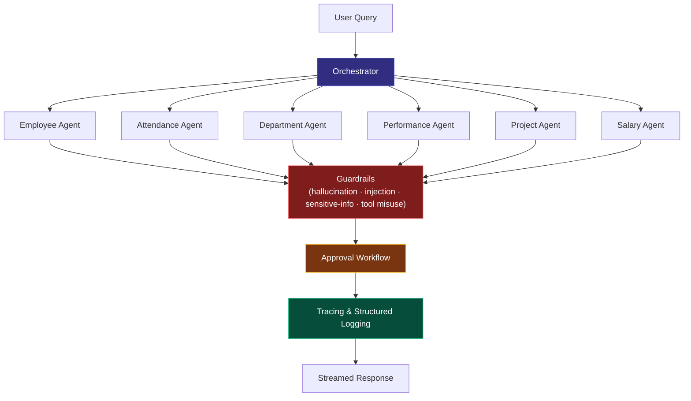

  

<h1 align="center">Hey, I'm Yash Shah 👋</h1>
<h3 align="center">Frontend Engineer (10 yrs) → building toward AI / Agentic AI Engineering</h3>

  

  
  

📍 Mumbai, India

 

## 💫 About Me

- 🧑‍💻 **Frontend Engineer, 10 years** — React, TypeScript, Redux, micro-frontend architecture
- 🏢 Currently **Senior Consultant, Frontend @ EY**
- 🤖 Actively building **agentic AI systems** with the **OpenAI Agents SDK** — multi-agent orchestration, guardrails, tracing, approval workflows
- ✍️ Writing a Medium series on building AI agents in TypeScript as I build them
- 🎯 Not switching lanes — extending 10 years of production frontend discipline into AI engineering

 

## 🧭 Engineering Journey

## 🧭 Engineering Journey

| Phase | What it means |
|---|---|
| 🎓 Software Engineering | 10 years across web design, React development, and enterprise consulting |
| ⚛️ Frontend Specialization | Deep React/TypeScript work at Sportz Interactive and TCS |
| 🏗️ Scalable Architecture | Micro-frontend and Module Federation work at scale, now at EY |
| 🤖 AI Engineering | Learning and applying the OpenAI Agents SDK |
| 🕸️ Agentic Systems | *(current)* — Employee AI Assistant: multi-agent orchestration, guardrails, tracing |

Frontend engineering is still the foundation — the agentic work is built with the same architecture-first, production-quality bar.

 

## 🚀 Featured Project — Employee AI Assistant

A multi-agent backend for querying and acting on employee data, built with **TypeScript, Node.js, Express, React, and the OpenAI Agents SDK**.

| Area | Implementation |
|---|---|
| Orchestration | Central orchestrator routes to six domain agents (employee, attendance, department, performance, project, salary), each built from a shared agent factory |
| Guardrails | Dedicated checks for hallucination, prompt injection, sensitive-info exposure, and tool misuse — each with its own test script |
| Approvals | Approval-store workflow gates sensitive actions before execution |
| Observability | Structured tracing with a dedicated trace store, logging processor, and trace API |
| Conversation | Session-managed, streaming chat over a dedicated chat route/controller |
| API surface | JWT auth, rate limiting, Zod validation, Swagger/OpenAPI docs |
| Data layer | CSV-backed services across all six domains |

**→ [github.com/shahyash1136/employee-ai-assistant](https://github.com/shahyash1136/employee-ai-assistant)**

 

## 📁 Other Projects

| Project | What it does | Stack |
|---|---|---|
| **agentic-ticket-processing** | Support-ticket triage built on a layered agent architecture — intent classification, detection, and routing | Python |
| **pdf-to-excel-python** | Desktop app extracting tables from digital and scanned PDFs (OCR), merging matched tables into an Excel workbook | Python, pdfplumber, pytesseract, openpyxl |
| **micro-frontend** | Two federated apps exploring Module Federation patterns used in production frontend work | TypeScript |

 

## 🛠️ Tech Stack

**Frontend**

**Backend & Data**

**AI / Agentic & Testing**

 

## 📚 Currently Exploring

- Structured ML/AI coursework, tracked against a phased learning plan
- DSA and system design, preparing for product-company interviews
- Docker, with a roadmap toward containerizing a full React/Node/MongoDB stack

 

## ✍️ Writing

*Building AI Agents with OpenAI Agents SDK (TypeScript)* on Medium — walking through the agentic concepts (agents, tools, handoffs, MCP, tracing) as I apply them to the Employee AI Assistant build.

**→ [medium.com/@shahyash1136](https://medium.com/@shahyash1136)**

 

## 💼 Experience

| Company | Role | Dates |
|---|---|---|
| EY | Senior Consultant, Frontend | Oct 2024 – Present |
| Tata Consultancy Services | I.T. Analyst | Mar 2022 – Oct 2024 |
| Sportz Interactive | Associate → Senior Associate, React/CSS Developer | May 2018 – Feb 2022 |
| Senseware Infomedia | Jr. Web Designer | Apr 2016 – May 2018 |

 

Open to product-company frontend and AI engineering conversations

